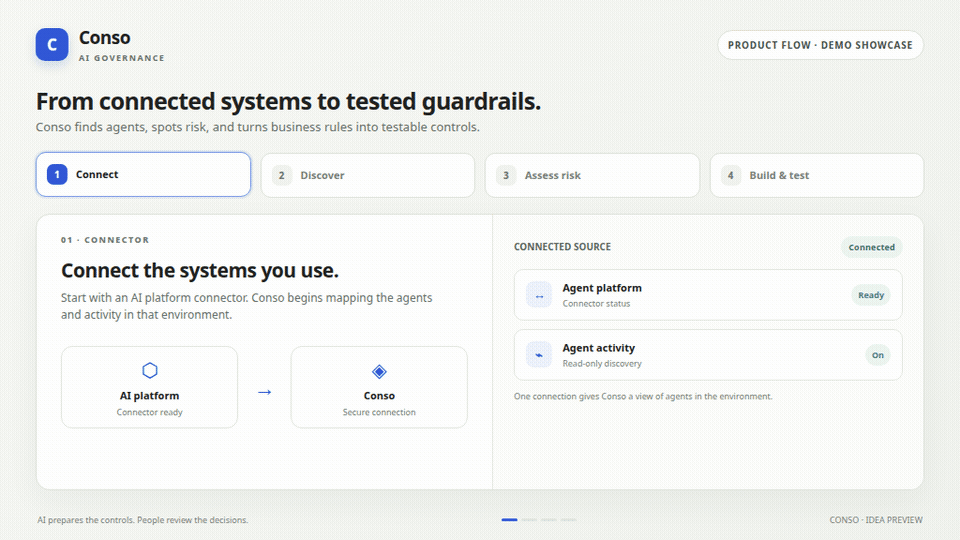

# Conso

**AI governance for agents — from discovery to tested guardrails.**

## The problem

Businesses connect AI agents faster than they can understand what those agents do or manage the risks they create.

## The idea

Conso connects to an AI environment, discovers agents automatically, assesses risk, and builds and tests guardrail policies for people to review.

**Connect → Discover agents → Assess risk → Build and test guardrails**

[Explore the demo](https://consoui-poqnbscp.manus.space/) · [Watch the GTM video](https://manus.im/share/file/9f1a96c1-af15-4caf-88ef-5c00ab15349f) · [Architecture overview](docs/ARCHITECTURE.md)

> Built with **Manus AI**.

*Showcase only: this repo explains the Conso idea and links to its demo. It is not a software download. The animation illustrates the intended product flow; live integrations and policy enforcement are not implemented in this demo.*
